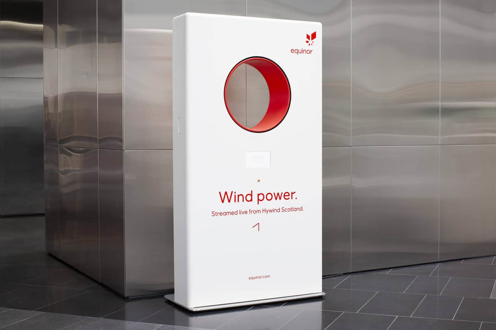

# Windportal
An interactive installation demonstrating the power of the wind.

The machine simulates the wind conditions at the Hywind off-shore windmill part in Scotland.
Live data about current windspeed conditions are fetched, and the audience can press a button
to experience this wind-power blowing in their face.

Developed for Equinor in collaboration with ad-agency [Dept](http://dept.no).

[More info, pictures and video](https://dept.no/project/equinor-wind-portal)

## Contents
This repo contains the software and electronics of the system,
developed by Martin Stensgård and [Jon Nordby](http://jonnor.com).

A previous iteration can be found at [jonnor/windportal](https://github.com/jonnor/windportal).

## License
[ISC](./LICENSE.md)

